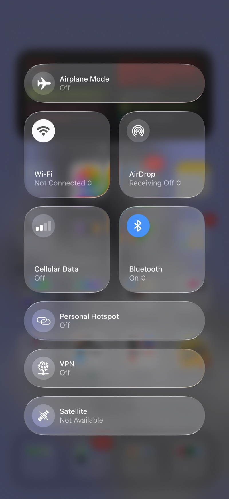
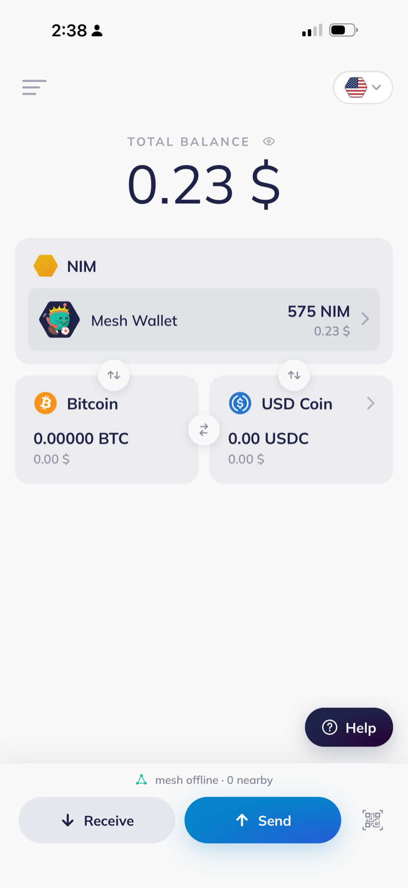
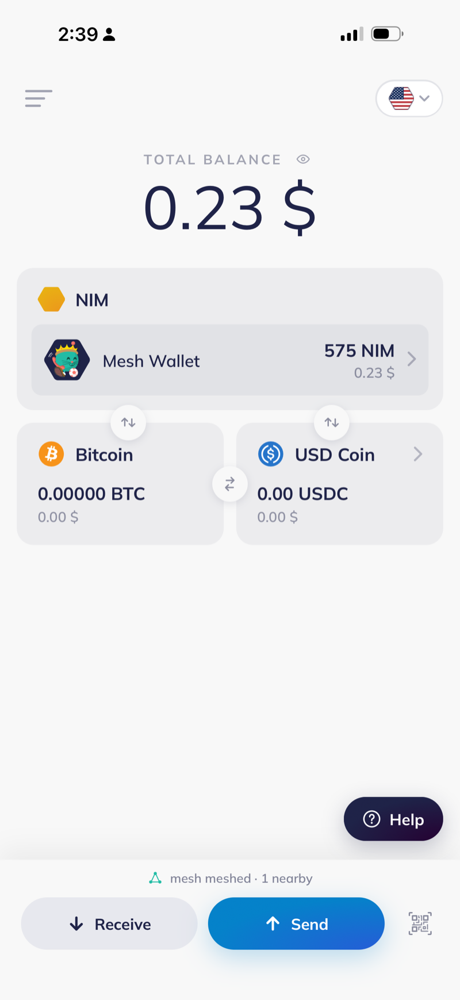
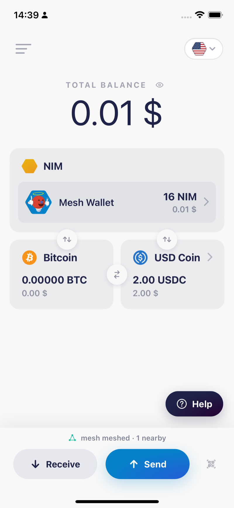

# nimiq.nimmesh

**Pay with NIM when there is no internet.**

nimiq.nimmesh is a native, true multi hop **Bluetooth LE mesh** wallet for Nimiq. You sign a transaction on a phone with zero
connectivity. It then hops device to device through other people's phones. The first one to
have a connection, *anyone* at all, broadcasts it to the Nimiq network for you.

<p align="center">
  
  
  
  
</p>
<p align="center"><em>Phone A has cellular data and Wi-Fi off, Bluetooth on: alone at first, then meshed. Phone B is online over Wi-Fi and sees the same mesh from the other side.</em></p>

The whole idea rests on one fact. A signed Albatross transaction is a self contained
**~139 byte blob** carrying its own Ed25519 proof, valid for roughly two hours. The chain does
not care how those bytes reached a node, only that they are valid and arrive inside their
window. So the internet is needed at the **final hop only**. Everything before it can be a mesh
of phones passing bytes over Bluetooth.

It is a Nimiq take on [Bitchat](https://github.com/permissionlesstech/bitchat): the same BLE
mesh and store and forward, but the payload is a signed transaction instead of a chat message.

## How it works

```
 Alice (airplane mode)          Bob (offline relay)         Carol (has data = gateway)
 ......................         ...................         ..........................
 sign tx offline (139 B)  -->   dedup, TTL-1, relay   -->    sendRawTransaction(rawHex)
 wrap nimiqTx 0x30, TTL=7       (never reads payload)        -> Nimiq mempool -> validators
 flood over BLE                                              emit nimiqTxReceipt 0x31 --+
        ^                                                                               |
        +---------------- "pending -> settled" (store and forward back to Alice) <------+
```

Only Carol's one egress hop was ever online. Bob never sees what he carried.

## Proven on mainnet

Every claim here has an on chain or in repo receipt. Nothing below is a simulation.

| What | Receipt |
| --- | --- |
| First real funds mesh payment | 1 NIM, block **55488525**, tx `8ad87a7b…677f5`. Phone in airplane mode, over Bluetooth to a Mac gateway, onto the chain. |
| Phone to phone, no Mac | 1 + 15 + 2 NIM, blocks **56054933 / 56055090 / 56055105**. Airplane mode iPhone 17 relayed to an iPhone 12 Pro that broadcast them. |
| Bitchat interoperability | Live both directions, phone to phone, no Mac. A NIMmesh message rendered in real Bitchat `#mesh`, and a Bitchat message rendered in NIMmesh. `shared/BitchatKit.swift` is byte exact against their wire format. |

**Not yet proven, and labelled as such.** Cash links exist in the app: created, funded (over
the mesh when offline), shared, and claimable. But no cashlink has been handed over the mesh
and swept end to end, so that claim carries no receipt and does not belong in the table above.
Cross chain NIM to USDC atomic swaps run end to end
and settle, but on Nimiq testnet and Polygon Amoy. Three consecutive clean soak runs at 0.89.0,
roughly 30 seconds each. The phone to phone **mainnet** swap has not been run. Do not read the
swap code as mainnet proven.

## Architecture

See [ADR-0001](docs/adr/0001-native-rust-core-uniffi-stack.md).

- **Shared Rust core** over UniFFI. Nimiq signing on Ed25519, packet codec, TTL and hop relay,
  LRU dedup, GCS store and forward, Noise sessions, gateway broadcast. No WASM, no consensus
  client. Headless tested in CI.
- **iOS** in Swift with CoreBluetooth, running central and peripheral roles concurrently.
  That is what makes it a real mesh rather than a hub and spoke.
  It is also why NIMmesh can never be a WebView mini app. Web Bluetooth is central role only.
- **Android** planned in Kotlin on `android.bluetooth.le`. The core is already UniFFI ready.
- **UI** is the Nimiq wallet's own design language, running in a WKWebView over the native core.
- **Protocol** ported from Bitchat, public domain. See [docs/PROTOCOL.md](docs/PROTOCOL.md).

Secret material never crosses the FFI boundary. The recovery phrase and derived key live in
Swift and the Keychain; only public, broadcast safe bytes ride the mesh.

## Install

iOS, Ad Hoc signed: **https://nimiq-nimmesh.pages.dev/ota/**

Open that page in **Safari** on the iPhone and tap Install. There is no TestFlight step and no
trust step. Ad Hoc builds install on registered devices only, so send your device UDID first.

## Status

Version **0.89.4**, mainnet by default, real funds. This is field tested software, not audited
software. Two phones and one Mac gateway have carried real value; it has not been reviewed by
anyone but its author. Treat it accordingly.

## Docs

| Doc | What |
| --- | ---- |
| [docs/GOAL.md](docs/GOAL.md) | North star, the magic moment, the demo loop, core values |
| [docs/PROTOCOL.md](docs/PROTOCOL.md) | The NIMmesh wire format |
| [docs/RISKS.md](docs/RISKS.md) | Offline payment hazard analysis and mitigations |
| [docs/MAINNET-GATING.md](docs/MAINNET-GATING.md) | The safety contract around real funds |
| [docs/adr/](docs/adr/) | Architecture decisions |
| [docs/LOOP.md](docs/LOOP.md) | The autonomous build contract this repo was written under |

## Safety

- Non custodial by construction.
- The UI never shows "paid" before the transaction confirms on chain.
- Relays are content blind and carry bytes they cannot read.
- Transactions are verified before relay, so a flooding peer cannot turn the mesh into a junk amplifier.
- Keys never leave the phone: iOS holds them in the Keychain, Android keeps the phrase encrypted under an AndroidKeyStore key.
- Relays cannot tie payments to a wallet: the sender id is random on every launch, never wallet derived.

The hazard analysis, including what these guarantees do not cover, is [docs/RISKS.md](docs/RISKS.md).

## License

[Apache 2.0](LICENSE). Third party attributions are in [NOTICE](NOTICE).
